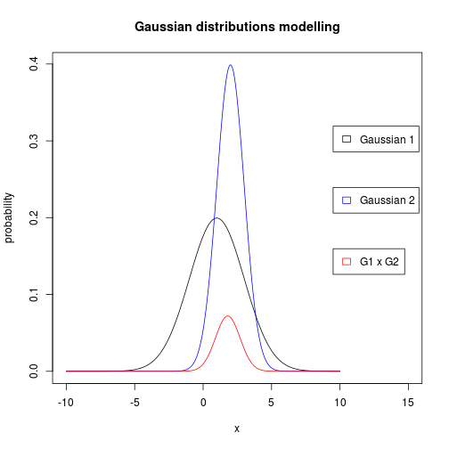

Gaussian multiplication with shiny!
========================================================
author: J. F.
date: September 22 2014

Presentation for the Project of the Developing Data Products course.


Gaussian or normal distribution
========================================================
transition: rotate

It is defined as:
$\frac{1}{\sigma\sqrt{2\pi}}e^\frac{(x-\mu)^2}{2\sigma^2}$,

where $\mu$ is the mean and $\sigma$ is the standard deviation of the distribution over $x$. 

It is one of the most important concepts in statistics and are used to model random variables whose distributions are unknows.

Multiplication of Gaussians
========================================================

The multiplication of two Gaussian distributions leads to another Gaussian as:

$\mathcal{N}(a,A) \cdot \mathcal{N}(b,B)  \propto \mathcal{N}(c,C)$,

where $a$, $b$ and $c$ are the mean vectors and $A$, $B$ and $C$ are the variance matrices of the Gaussians to involved in the multiplication. Then:

$C=(A^{-1}+B^{-1})^{-1}$ 

and

$c=CA^{-1}a+CB^{-1}b$.

Application
========================================================

This plot is rendered from R code embedded in the slide.
 

Implementation in shiny
========================================================

The demo of this project application can be accessed via: https://neofranz.shinyapps.io/Project/ . The Gaussian multiplication in the server.R file is implemented as: 

```r
shinyServer(
  function(input, output) {
  x   <- seq(-10,10,length=1001) 
    output$gaussianPlots <- renderPlot({
      df1 <- dnorm(x, mean = input$mean1, sd = input$sdev1, log = FALSE) # Gaussian 1
      df2 <- dnorm(x, mean = input$mean2, sd = input$sdev2, log = FALSE) # Gaussian 2
      df3 <- df1 * df2 # Multiplication of Gaussian 1 and Gaussian 2
      # Code to generate the plots
      }) })
```


